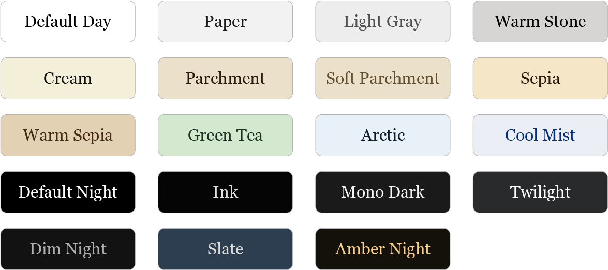

# KOReader color theme patch

A user patch for KOReader that adds extended color theme control for reading:

- separate presets for **UI** and **book content**
- presets for **day** and **night** mode
- a curated set of clean light and dark presets out of the box
- create and edit your own themes directly from the settings menu

Inspired by and partially based on ideas from [`Euphoriyy/KOReader.patches`](https://github.com/Euphoriyy/KOReader.patches/).

**Compatibility**
Tested on Android devices.

## Preview

<p align="center">
  
</p>

## Built‑in presets

<p align="center">
  
</p>

…or create your own theme via **Add theme…** in the menu.

## Installation

1. Download `2-color-theme.lua`.
2. Copy it to your KOReader user patches directory, for example:

   ```text
   koreader/patches/2-color-theme.lua
   ```

3. Restart KOReader.
4. Open the settings menu — you will see a new `Themes` entry with extended controls.

## Menus and presets

The patch adds one main entry to the settings menu:

<pre>
⚙️
└── <b>Themes</b>
    ├── <b>Day UI</b> – light/dark presets for the interface in day mode
    ├── <b>Day book</b> – light/dark presets for book pages in day mode
    ├── <b>Night UI</b> – dark/light presets for the interface in night mode
    ├── <b>Night book</b> – dark/light presets for book pages in night mode
    ├── <b>Add theme…</b> – create a custom preset
    └── <b>Restore themes to default</b> – reset to KOReader defaults
</pre>

Each of the four submenus shows the same list of presets, grouped by brightness, for example:

- `Day UI – Light themes`
- `Day UI – Dark themes`
- `Night book – Dark themes`
- `Night book – Light themes`

## Usage

- Open **Settings → Themes** in KOReader.
- Tap one of:
  - `Day UI`
  - `Day book`
  - `Night UI`
  - `Night book`
- Tap a preset to apply it to that target.
- Long‑press a preset to edit or delete it.
- Use **Add theme…** to create a new custom preset.
- Use **Restore themes to default** to return to KOReader’s stock `Default Day` / `Default Night` behavior.

## Support

If this patch is useful to you and you'd like to support further development of KOReader-related projects, you can support me on Ko‑fi:

[](https://ko-fi.com/artemartemenko)
